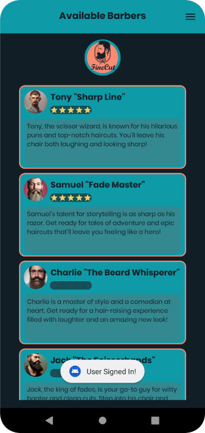
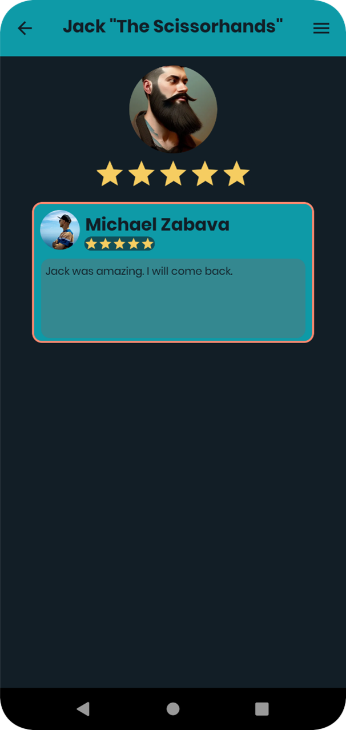

# <h1 align="center">Fine Cut Barber Shop App</h1>

<h3 align="left">Fine Cut - Barber Shop is a handy app made for barber shops. 
It helps make booking appointments easy for clients and lets them pick the best barber using reviews.</h3>

<h4 align="left">Main Futures:</h4>

- User Registration
- User Login
- Listing Available Barbers
- Booking an appointment (Select a date and time, service, add discount code, apply points)
- User collect royality points with each booking
- Users can cancel appointments at any time
- Users can see and leave reviews
- Users can see available offers
- The application send notifications to remind users about appointments and offers
- Users can see their booking history and future appointments
- Users can get directions to the shop

<h4 align="left">Application Screenshots:</h4>

- User Registration Screen

- User Login Screen

- Home Screen

- Booking

- Side Menu

- My Profile Screen

- My Bookings Screen

- Edit Details Screen

- Barbers Rating Screen

- Offers Screen

<h4 align="left">All screenshots where made on a Pixel 4 with Android 12 (Virtual Device)</h4>
